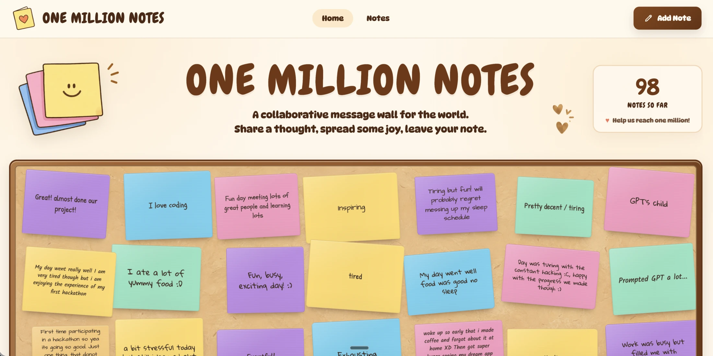

# One Million Notes

A collaborative corkboard for collecting one million small thoughts, moments,
and observations from people around the world.

[Visit One Million Notes](https://one-million-notes.evan-he24.workers.dev)



## The idea

One Million Notes is deliberately simple: write a short note and add it to a
shared wall. There are no accounts, profiles, likes, or feeds competing for
attention—just a growing collection of messages from real people.

The interface is built to feel physical rather than app-like. Notes have
handwritten type, paper texture, small rotations, soft shadows, and stable
visual variations derived from their position on the wall.

## Tech stack

| Layer | Technology |
| --- | --- |
| Interface | Next.js 15, React 19, TypeScript, handcrafted CSS |
| Runtime | Cloudflare Workers via OpenNext, with a Vercel mirror |
| Database | Cloudflare D1 |
| Observability | Cloudflare and Vercel Web Analytics, plus Workers observability |
| Large-list rendering | `react-window` and `react-virtualized-auto-sizer` |
| Moderation | Local validation with optional Gemini classification |
| Tooling | Wrangler, ESLint, TypeScript |

## How it works

```text
Browser
   │
   ▼
Next.js App Router on a Cloudflare Worker
   ├── server-renders the initial wall
   └── validates and moderates new submissions
                         │
                         ▼
                    Cloudflare D1
```

The first page load is rendered at the edge with notes read directly from D1.
New submissions go through a same-origin API route, where length and link
checks run before optional AI moderation. Approved notes and the public counter
are then updated together in a D1 batch.

The canonical Worker uses its native D1 binding. Hosts without D1 can set
`NOTES_BACKEND_ORIGIN` to reuse the same server-rendered application while
forwarding data operations to the Worker; no database credentials reach those
deployments or the browser.

## Interesting details

- **Archive-to-D1 migration.** A preserved JSON snapshot remains the canonical
  archive. A deterministic generator converts it into an idempotent SQL seed
  migration while keeping archival data out of the runtime bundle.
- **A wall that can keep growing.** The corkboard is virtualized, so the browser
  renders only visible rows instead of mounting every note at once.
- **Stable visual randomness.** Color, rotation, font, and shape are derived
  from note identity and position. The wall feels handmade without notes
  jumping around between renders.
- **Edge-native data access.** Server components and API routes share one small
  D1 repository layer. Database credentials and bindings never reach the
  browser.
- **Fail-closed moderation.** Local rules reject malformed submissions and
  links immediately. When Gemini moderation is enabled, an unavailable or
  ambiguous classifier does not silently publish the note.
- **Purpose-built artwork.** The cork texture, sticky-note illustrations,
  favicon, social preview, and whimsical font system are bundled with the site
  instead of fetched from third-party design services.

---

Made with ♥ by [Evan He](https://www.evanhe.co/).
